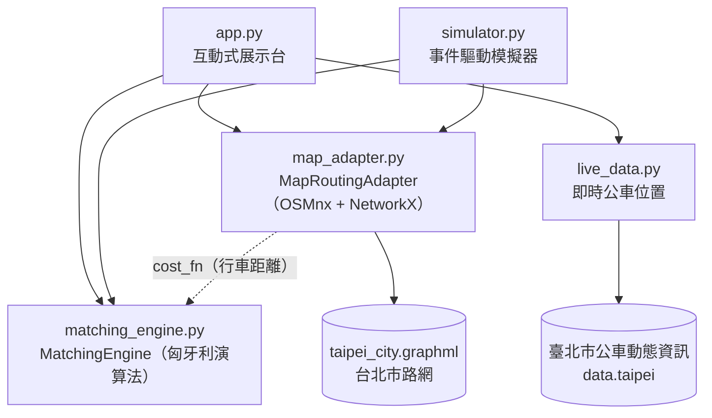

# 即時共乘派單與最佳化配對系統

**Real-Time Ride-Sharing Dispatch & Optimal Matching System**

[](https://taipei-ride-matching.streamlit.app/)

**線上 Demo**：<https://taipei-ride-matching.streamlit.app/> ｜ **原始碼**：<https://github.com/330Jason/ride-sharing-matching>

> Demo 一段時間沒人使用會進入休眠，開啟後若看到喚醒畫面，按一下按鈕約一分鐘就會恢復。

以匈牙利演算法求解司機與乘客的全域最低成本配對，串接台北市真實街道路網計算行車距離、支援動態封路繞道，並能抓取臺北市公車此刻的 GPS 位置當作司機，用真實車流測試派單。整套流程以事件驅動模擬器與互動式地圖展示。

> 大學畢業專題

## 動機

共乘平台派單的關鍵不在「幫每位乘客找到一位司機」，而在「讓整個系統的總接客成本最低」。直覺的貪婪法（每次先配成本最低的那一組）容易陷入區域最佳：

|                | 乘客 R1 (0, 5) | 乘客 R2 (0, 14) |
| -------------- | -------------- | --------------- |
| 司機 D1 (0, 0) | 5              | 14              |
| 司機 D2 (0, 8) | **3**          | 6               |

貪婪法先搶最便宜的 D2→R1（3），D1 只剩 R2 可接（14），總成本 **17**；全域最佳解是 D1→R1 + D2→R2，總成本 **11**。本專題把這個指派問題（Assignment Problem）搬到真實城市路網上，驗證能否穩定求出全域最佳解，並在路況改變時即時重新規劃。

## 功能

- **全域最佳配對**：以 SciPy `linear_sum_assignment`（匈牙利演算法）求司機—乘客的最低總成本配對，司機與乘客數量不必相等
- **真實路網成本**：用 OSMnx 載入台北市 OpenStreetMap 汽車路網（11,967 個路口、28,344 條路段），以 Dijkstra 最短路徑計算實際行車距離
- **動態封路**：在地圖上封鎖路口後，配對成本與路徑都會自動繞道；到不了的組合絕不會被配對
- **即時範例**：抓取臺北市公車此刻的 GPS 位置當作司機，並在目前地圖畫面內隨機產生乘客，直接用真實車流測試派單
- **事件驅動模擬**：以秒為單位推進時間，乘客陸續叫車、每 5 秒批次派單、行程結束後司機停在目的地重新待命
- **互動式展示台**：Streamlit + Folium 網頁，直接點地圖新增司機、乘客與封鎖路口，畫出每組配對沿著街道形狀的真實行車路線

## 系統架構



各層透過注入的函式解耦：`MatchingEngine` 只接受「給一位司機與一位乘客，回傳成本」的 `cost_fn`，不知道成本來自曼哈頓距離還是真實路網；`live_data` 判斷公車是否在路網上，也是由呼叫端注入判斷函式。因此核心演算法與即時資料模組都不依賴地圖套件，可以獨立測試。

| 檔案                      | 說明                                                                     |
| ------------------------- | ------------------------------------------------------------------------ |
| `matching_engine.py`      | 配對引擎：`Driver` / `Rider` 資料結構、成本矩陣、匈牙利演算法、不可達處理 |
| `map_adapter.py`          | 路網轉接器：載入並快取 OSM 路網、最短行車距離與路徑、動態封路、批次成本函式 |
| `live_data.py`            | 即時車輛資料：下載並解析臺北市公車即時位置，在地圖畫面內取樣司機與乘客   |
| `simulator.py`            | 事件驅動批量派單模擬器                                                   |
| `app.py`                  | Streamlit 互動式展示台                                                   |
| `test_matching_engine.py` | 配對引擎的 22 個單元測試                                                 |
| `test_live_data.py`       | 即時資料模組的 44 個單元測試（離線執行，不連網）                         |
| `test_map_adapter.py`     | 路徑繪製的 6 個單元測試（以小型人工路網驗證，離線執行）                  |
| `taipei_city.graphml`     | 台北市汽車路網快取，免去每次向 OSM 下載                                  |

## 技術重點

### 不可達組合的處理

封路後某些司機到不了某些乘客，成本為 `inf`，但 `linear_sum_assignment` 不接受 `inf`。做法是先標出可達的組合，再把不可達的格子換成「哨兵值」：它大於任何一組可行配對的總成本，所以演算法會盡量避開，只有別無選擇時才會選到；求解後再濾掉落在不可達組合上的結果。

### 批次最短路徑

逐一計算每組司機—乘客的最短路徑，需要跑 n×m 次 Dijkstra。改為每位司機只跑一次單源 Dijkstra（`single_source_dijkstra_path_length`），一次取得到全路網每個路口的距離，之後每組成本只是 O(1) 查表，複雜度從 O(n·m·Dijkstra) 降為 O(n·Dijkstra)。

### 封路不污染原圖

每次套用封路都從原始路網複製一份，再移除被封鎖的路口，原圖永不改動。因此解除封路能完全還原，重複封路也不會累積錯誤。

### 路線要沿著道路的實際形狀畫

OSMnx 會簡化路網：兩個路口之間的彎道與繞行只留下頭尾節點，中間的形狀存在路段的 `geometry` 屬性裡（全市 28,344 段中有 18,971 段帶有形狀）。若只把路口連成直線，畫出來的路線會橫切過街廓——實測 58 條隨機路線中有 43 條偏離真實道路超過 30 公尺，中位數 61 公尺、最遠 513 公尺。改成沿著 `geometry` 輸出後，路線上的取樣點全部落在道路上。

標記與最近路口之間還有一小段落差（點擊位置或公車位置不會剛好在路口），那段不是道路，因此改以細虛線另外繪製，不混進行駛路線裡。

### 即時資料：用公車代替叫車司機

叫車平台（Uber、台灣大車隊等）的司機位置是業者的私有資料，沒有公開 API，爬取其 App 也違反服務條款與司機隱私。台北市公開的即時車輛位置是臺北市資料大平臺的公車 GPS，所以即時範例以此刻正在行駛的公車作為司機：

- 只取勤務中且行車正常的公車，排除尚未發車、已駛離末站與非營運狀態的車輛
- 以資料中最新一筆的時間為基準，過濾超過 3 分鐘沒回報位置的公車，不受伺服器時區與時鐘影響
- 取樣半徑依地圖縮放計算，確保所有標記都落在目前畫面內
- 略過路網範圍外的公車（例如在新北市），否則最近節點會吸附到市界，路徑畫在錯誤的位置

## 快速開始

不想安裝的話，直接開[線上 Demo](https://taipei-ride-matching.streamlit.app/) 就能操作。要在自己的電腦上跑，需要 Python 3.11 以上（開發環境為 3.12）：

```bash
pip install -r requirements.txt
streamlit run app.py
```

瀏覽器會自動開啟 http://localhost:8501 。若出現 `command not found: streamlit`，改用 `python3 -m streamlit run app.py`。

### 操作方式

1. 在側邊欄選擇點擊模式：新增司機、新增乘客或封鎖路口
2. 點擊地圖放置標記（藍色＝司機、紅色＝乘客、黑色＝封鎖路口）
3. 按「計算配對」，地圖會畫出每組配對的真實行車路線，下方列出行車距離與系統總成本

也可以用側邊欄的兩個範例按鈕直接放入司機與乘客：

- **載入預設範例**：台北市地標上的 3 位司機與 2 位乘客，不需要網路
- **載入即時範例**：在目前地圖畫面內抓最多 6 輛正在行駛的公車當司機，並隨機產生 4 位乘客；滑鼠移到司機標記上可以看到公車車牌

### 其他示範程式

每個模組底部都有可以直接執行的示範：

```bash
python3 matching_engine.py   # 2D 網格上的隨機配對與成本矩陣
python3 map_adapter.py       # 大同區地標在真實路網上的配對
python3 simulator.py         # 4 分鐘的批量派單模擬
python3 live_data.py         # 抓取公車即時位置，在真實路網上配對
```

`simulator.py` 的輸出節錄：

```
[Time: 00:05] Batch dispatch triggered: 5 idle driver(s), 2 waiting rider(s)
[Time: 00:05] Matched D3 to R1 (pickup 375m + trip 1204m), ETA: 190s (completes at 03:15)
[Time: 00:05] Matched D4 to R2 (pickup 203m + trip 858m), ETA: 128s (completes at 02:13)
...
[Time: 02:13] Trip completed: D4 finished trip with R2, now idle at (121.5155, 25.0495)
```

## 測試

```bash
pip install pytest
python3 -m pytest
```

72 個測試全部離線執行，涵蓋：

- 成本矩陣的形狀與數值（含司機、乘客數量不相等）
- 空輸入、一對一、數量不對等的邊界條件
- 全域最佳性：上面的貪婪反例，以及在隨機資料上與暴力枚舉解逐一比對
- 不可達組合：被封鎖的組合絕不出現在結果中，其他人仍取得最佳配對
- 路徑繪製：沿著道路實際形狀輸出、沒有形狀資料時退回路口連線、形狀方向相反時自動翻轉、平行路段與最短路徑選同一條
- 公車資料解析：營運狀態過濾、無效座標與時間、過時紀錄、損壞的下載檔
- 即時取樣：只取半徑內且在路網上的公車、路網外的公車不佔名額、同一個亂數種子結果可重現

## 技術棧

Python 3.12 · NumPy · SciPy · NetworkX · OSMnx · Shapely · Streamlit · Folium · pytest

## 資料來源

- 道路路網：[OpenStreetMap](https://www.openstreetmap.org/copyright) © OpenStreetMap contributors
- 公車即時位置：[臺北市資料大平臺](https://data.taipei/)「臺北市公車動態資訊」

## 目前限制與未來方向

- 路網是靜態快照，成本是距離而不是即時路況下的行車時間
- 配對成本只看司機到上車點的距離，不考慮乘客目的地
- 一台車只載一位乘客，尚未處理多位乘客共乘同一台車
- 模擬器以固定平均時速 30 km/h 估計行程時間
- 即時範例的司機是公車而不是叫車司機，乘客位置是隨機產生的；深夜公車收班後抓不到資料

未來可以加入即時路況與行車時間成本、多人共乘的路線規劃，以及依歷史叫車資料預測需求熱點、提前調度閒置司機。
